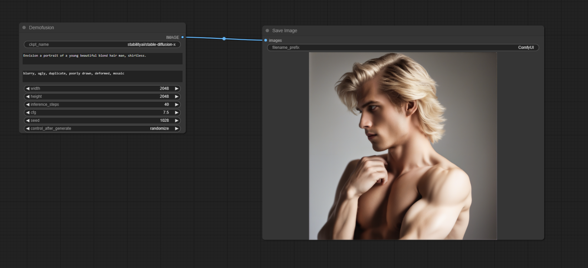

# ComfyUI Demofusion Custom Node

## Introduction

The Demofusion Custom Node is a wrapper that adapts the work and implementation of the Demofusion technique created and implemented by Ruoyi Du to the Comfyui environment.

The original paper and official implementations by Ruoyi Du can be found here :
- https://ruoyidu.github.io/demofusion/demofusion.html
- https://github.com/PRIS-CV/DemoFusion

My idea was wrapping Demofusion in a node to be used in ComfyUI, so we could use this amazing tool to experimenting with this technique. 

As it it my first ComfyUI custom node, I'm not sure if I'm implementing the best practices, so any comments and/or sugestions are welcome.

**Update:** Now you can also use local SDXL checkpoints! 

If anyone have some ideas about how to do it, again, thank you very much for yor collaboration and tips.

## Installing
To install this node, is just like any other one, no special procedures are needed:
    - Git clone the repository in the ComfyUI/custom_nodes folder
    - Restart ComfyUI

It's also good to remember that this technique requires a lot of VRAM (plus 18G). 

## How to use
Here you can see an example of how to use the node

And here it's the generated image (that can also works as the basic worflow, if you drag and drop it in the Comfyui browser window):

So far I've only tried to generate square images with 2048x2048 and 3072x3072. 

I've also only tried these Huggingface models:
- stabilityai/stable-diffusion-xl-base-1.0
- stablediffusionapi/sdxl-unstable-diffusers-y

Being the first one the model used by the author of the technique in his paper and implementation.  

## Under development
This node is under development, so use it at your own risk. And probably the interface will change a lot, impacting the generated workflows in the future versions.

